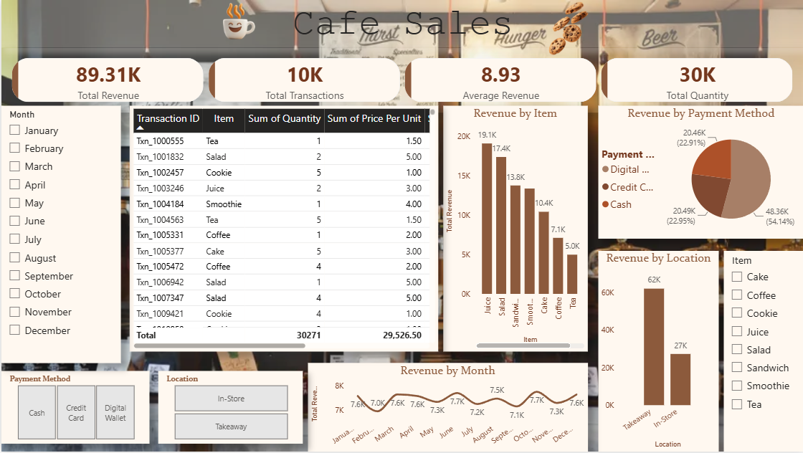
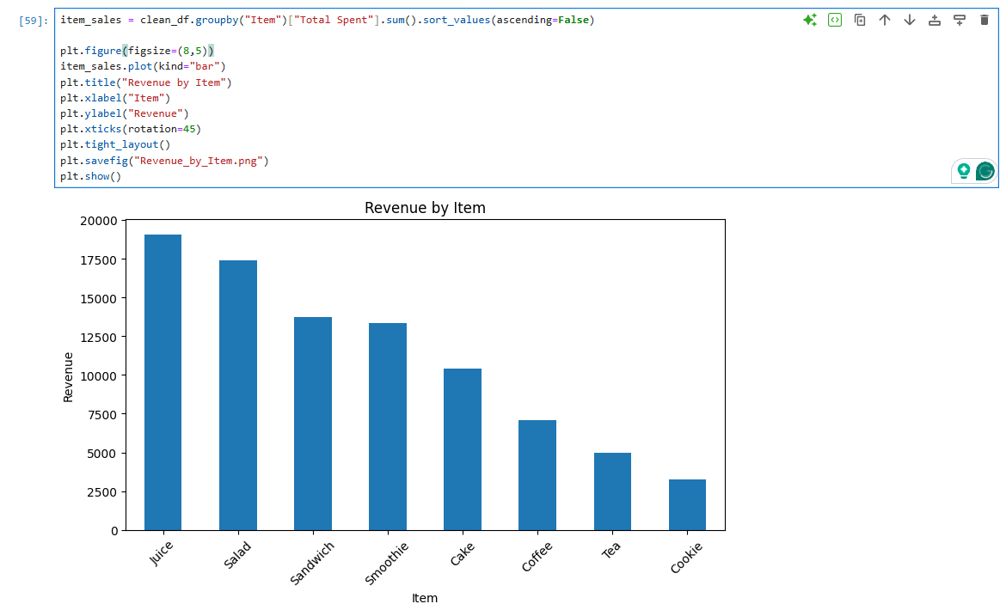
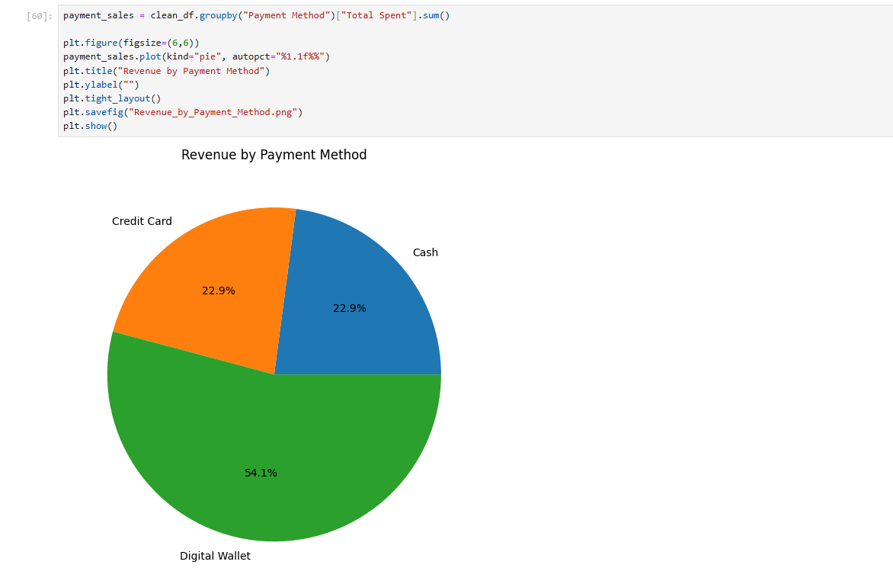
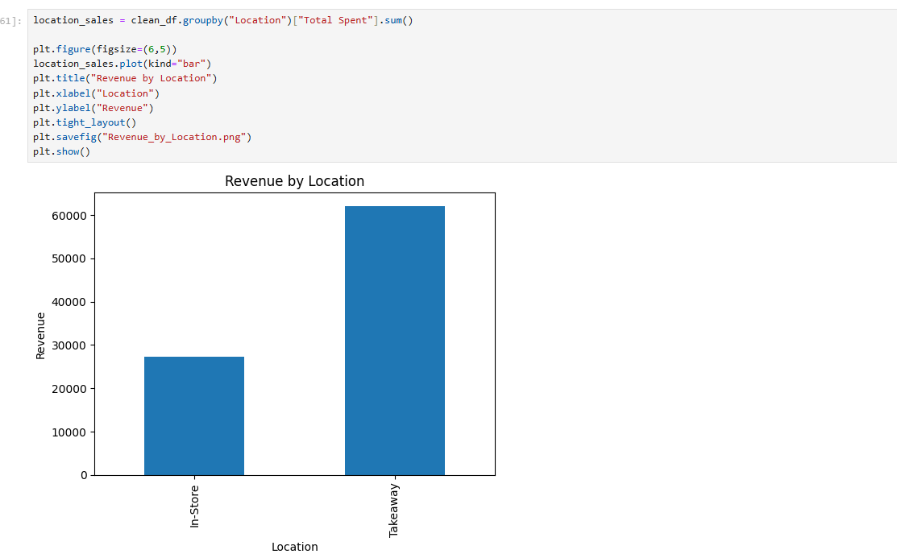
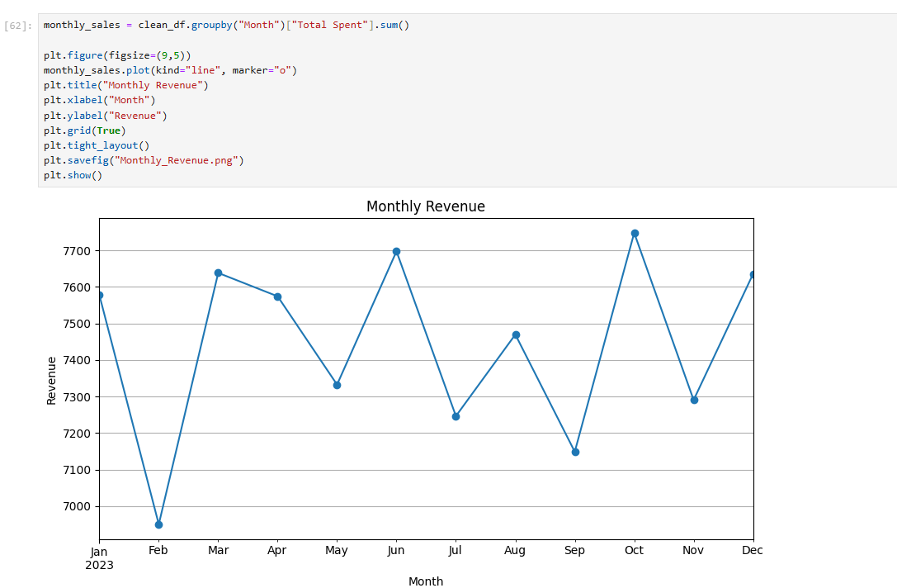
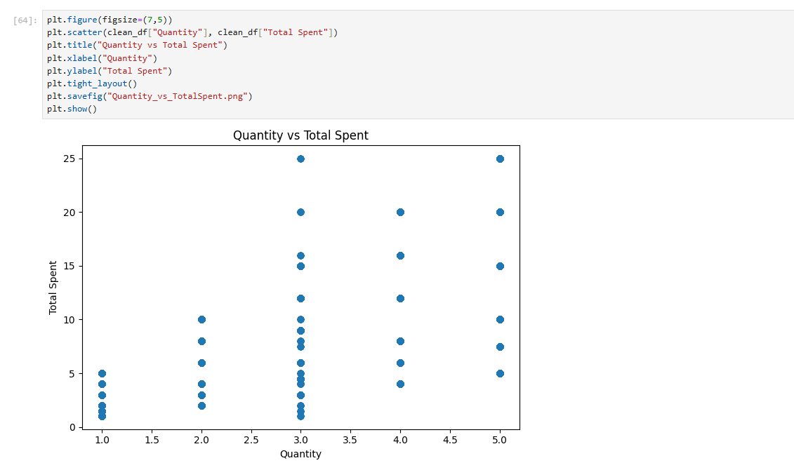

# Cafe_Sales_Analysis
An automated data cleaning and reporting solution that preprocesses raw datasets by handling missing values, duplicates, and inconsistent data using Python, then generates summary reports, visualizations, and an interactive Power BI dashboard for efficient business insights.

Data Cleaning & Reporting Automation

> Automating Data Cleaning, Reporting, and Business Insights using **Python** and **Power BI**.

---

## 📌 Project Overview

The **Data Cleaning & Reporting Automation** project automates the process of cleaning raw datasets and generating reports for business analysis. It uses **Python (Pandas)** to preprocess data by handling missing values, duplicates, invalid entries, and inconsistent formatting. The cleaned dataset is then visualized in **Power BI** through an interactive dashboard.

---

##  Features

- Import raw CSV/Excel datasets
- Handle missing values
- Remove duplicate records
- Clean invalid values (`ERROR`, `UNKNOWN`)
- Standardize text formatting
- Convert and validate date formats
- Generate automated summary reports
- Create visual charts using Python
- Build an interactive Power BI dashboard

---

##  Technologies Used

- Python
- Pandas
- NumPy
- Matplotlib
- OpenPyXL
- Microsoft Excel
- Power BI

---

## 📂 Project Structure

```
## Workflow

### 1. Load Dataset
- Import the raw CSV dataset into Python.

### 2. Inspect Data
- Check dataset information
- Identify missing values
- Detect duplicate records
- Verify data types

### 3. Data Cleaning
- Remove duplicate rows
- Handle missing values
- Replace invalid values (`ERROR`, `UNKNOWN`)
- Standardize text formatting
- Convert date columns
- Correct inconsistent entries

### 4. Export Cleaned Dataset
- Save the cleaned dataset as an Excel file.

### 5. Generate Reports
Generate:
- Total Records
- Total Sales
- Average Sales
- Maximum Sales
- Minimum Sales

### 6. Create Charts
Generate visualizations including:
- Sales by Category
- Sales by Payment Method
- Sales by Location
- Monthly Sales Trend

### 7. Build Power BI Dashboard
Create an interactive dashboard with:
- KPI Cards
- Bar Chart
- Line Chart
- Pie Chart
- Table
- Slicers
---

## 🧹 Data Cleaning Operations

- Removed duplicate records
- Handled missing values
- Cleaned invalid entries
- Standardized text values
- Converted data types
- Validated date formats
- Exported cleaned dataset

---

## 📈 Automated Reports

- Summary Report
- Cleaned Dataset
- Business Charts
- Power BI Dashboard

---

##  Dashboard Preview

```html
<p align="center">
  
</p>
```

---

# Jupyter Notebook Screenshots

<table align="center">
<tr>
<td align="center">
<br>
<b>Revenue By Item</b>
</td>

<td align="center">
<br>
<b>Revenue By Payment Method</b>
</td>

<td align="center">
<br>
<b>Revenue By Location</b>
</td>
</tr>

<tr>
<td align="center">
<br>
<b>Monthly Revenue</b>
</td>

<td align="center">
<br>
<b>Distribution of Total Spent</b>
</td>

<td align="center">
<br>
<b>Quantity VS Total-Spent</b>
</td>
</tr>
</table>

---
